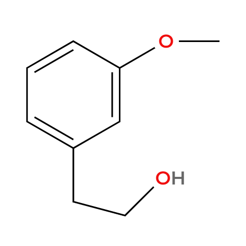
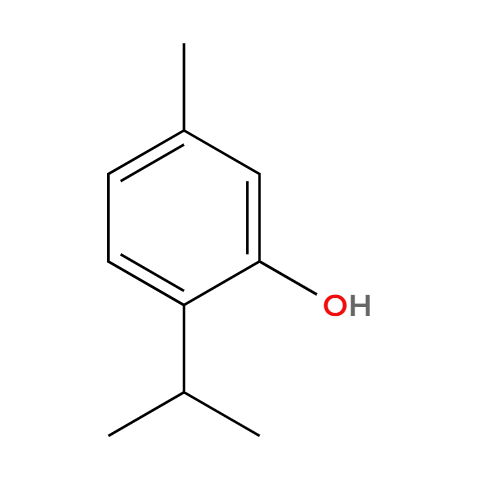
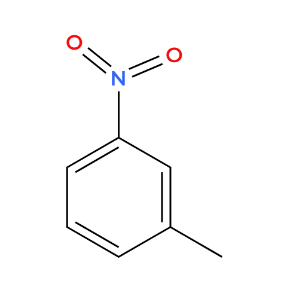
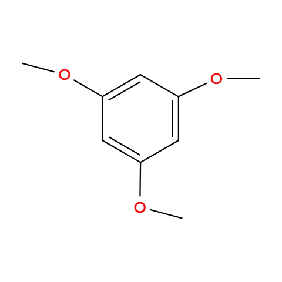
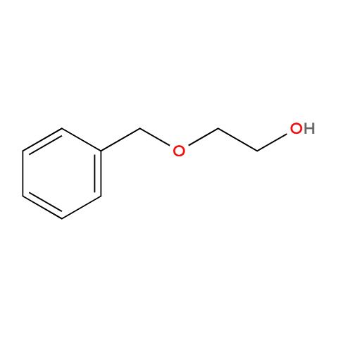
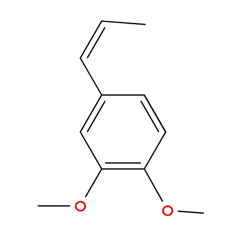
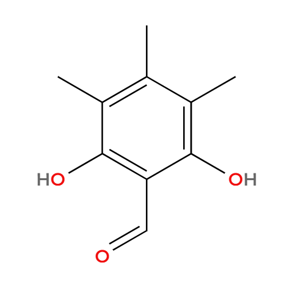
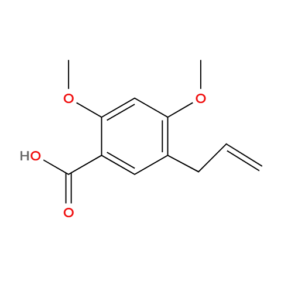
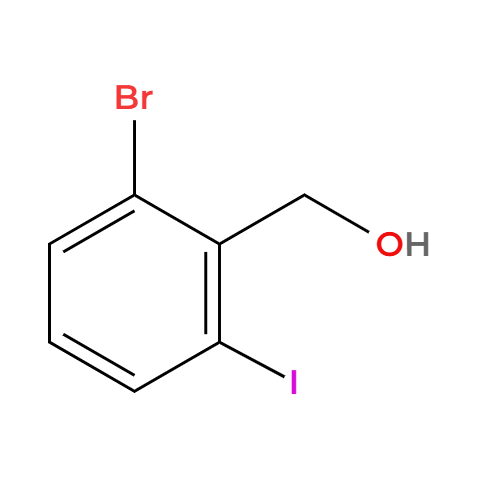

# 有机化学（以下均不考虑立体异构，满足的条件用(i)(ii)(iii)表示）  

## 例1：在的同分异构体中满足以下条件的有____种
### (i) 苯环上仅有两个取代基 
### (ii) 能与 $\mathrm{FeCl_3}$ 溶液反应显紫色 
### (iii) $1\mathrm{mol}$ 该同分异构体与足量 $\mathrm{Na}$ 反应，生成 $1\mathrm{mol}\;\mathrm{H}_2$
#### 其中核磁共振氢谱上峰面积比为6：2：2：1：1的结构简式是____  

## 例2：在的同分异构体中满足下列条件的有____种
### (i) 苯环上有两个取代基
### (ii) 遇$\mathrm{FeCl_3}$溶液显紫色 
#### 其中核磁共振氢谱上峰面积比为9：2：2：1的结构简式是____
#### 其中含有手性碳原子的结构简式是____（写出一种）  

## 例3：在的同分异构体中满足下列条件的有____种
### (i) $\mathsf{-NH_2}$ 与苯环直接相连
### (ii) 能发生银镜反应 
#### 其中核磁共振氢谱上峰面积之比为1:2:2:2的结构简式是____  

## 例4：在的同分异构体中满足下列条件的有____种
### (i) 含有$\mathrm{-COOH}$和$\mathrm{-Cl}$结构
### (ii) 含有苯环
#### 其中核磁共振氢谱上峰面积之比为2:2:1:1的结构简式是____

## 例5：在的同分异构体中满足下列条件的有____种 
### (i) 苯环上有两个取代基
### (ii) 与$\mathrm{FeCl_3}$溶液发生显色反应
### (iii) $1\mathrm{mol}$该同分异构体能与$3\mathrm{mol}\;\mathrm{Na}$反应  
#### 其中核磁共振氢谱上峰面积之比为4：2：2：2：1的结构简式是____

## 例6：在的同分异构体中满足下列条件的有____种
### (i) 苯环上有三个取代基
### (ii) 与$\mathrm{FeCl_3}$溶液发生显色反应
### (iii) $1\mathrm{mol}$该同分异构体最多能与$2\mathrm{mol}\;\mathrm{NaOH}$反应  
#### 其中核磁共振氢谱上峰面积之比为6：2：2：1：1的结构简式是____（写出一种）  

## 例7：在的同分异构体中满足下列条件的有____种
### (i) 苯环上有两个取代基
### (ii) 既能发生银镜反应又能发生水解反应
### (iii) $1\mathrm{mol}$该同分异构体至多能与$2\mathrm{mol}\;\mathrm{NaOH}$反应  
#### 其中核磁共振氢谱上峰面积之比为9：2：2：1的结构简式是____

## 例8：在的同分异构体中满足下列条件的有____种 
### (i) 苯环上有三个取代基
### (ii) 能与$\mathrm{FeCl_3}$溶液发生显色反应
### (iii) 既能发生银镜反应又能发生水解反应  
#### 其中含有6个化学环境相同的氢原子的结构简式是____（写出一种）  

## 例9：在的同分异构体中满足下列条件的有____种 
### (i) 是芳香族化合物
### (ii) 仅有一种官能团且能与$\mathrm{NaHCO_3}$反应放出气体
### (iii) 含有9个化学环境相同的氢原子  
#### 其中核磁共振氢谱有4组峰的结构简式是____（写出一种）  

## 例10：在的同分异构体中满足下列条件的有____种 
### (i) 与官能团相同且含有苯环
### (ii) 该同分异构体遇$\mathrm{FeCl_3}$溶液不发生显色反应 
#### 其中核磁共振氢谱有4组峰的结构简式是____（写出一种）  
