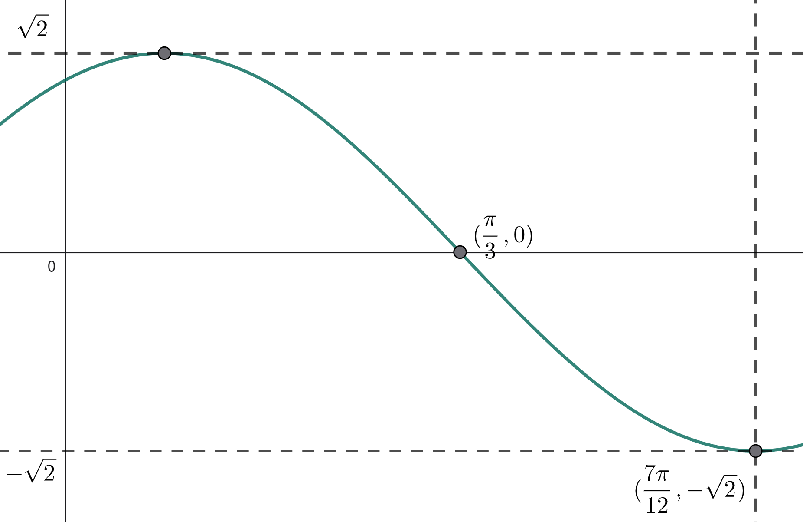
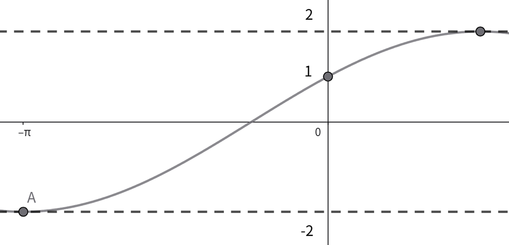
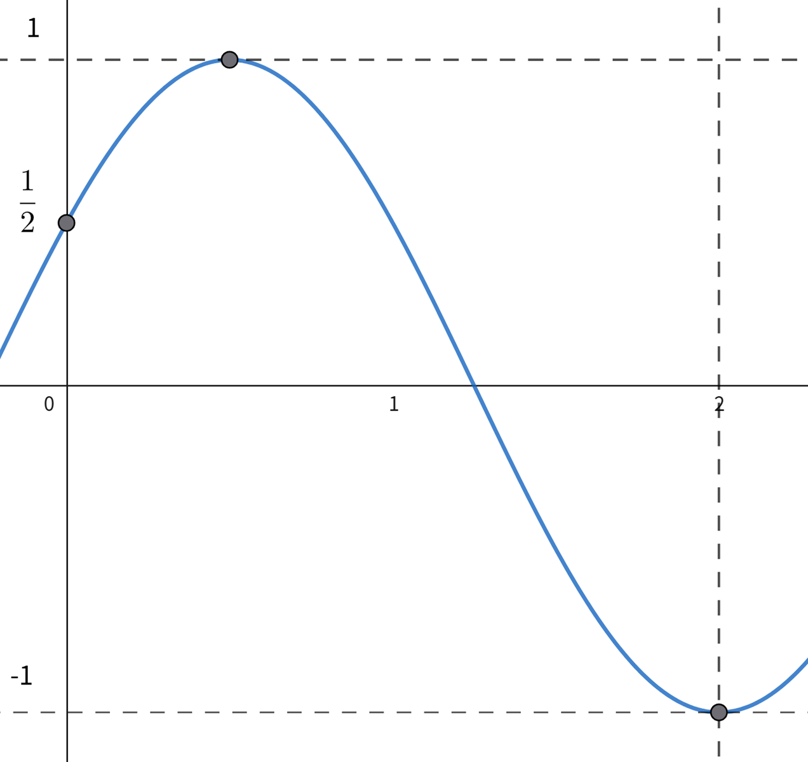
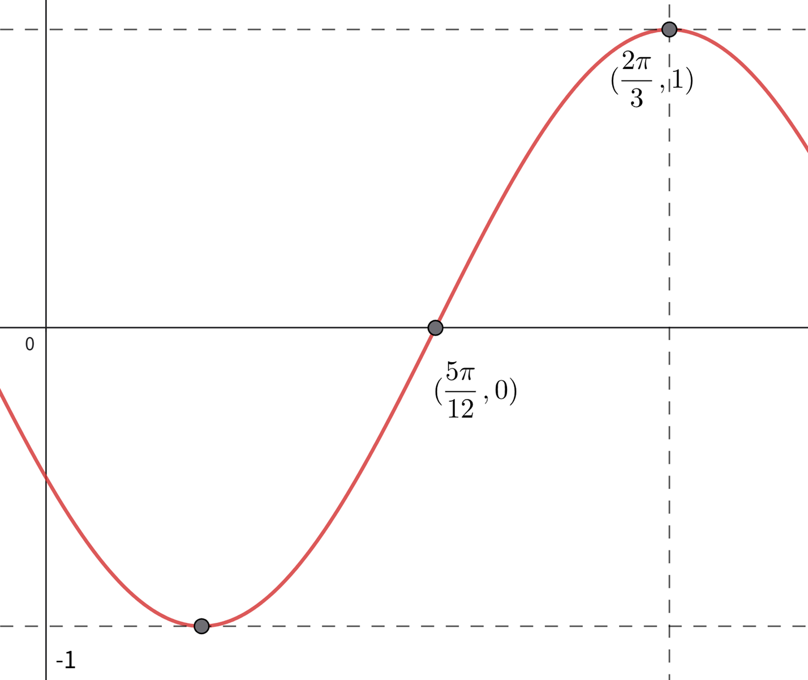
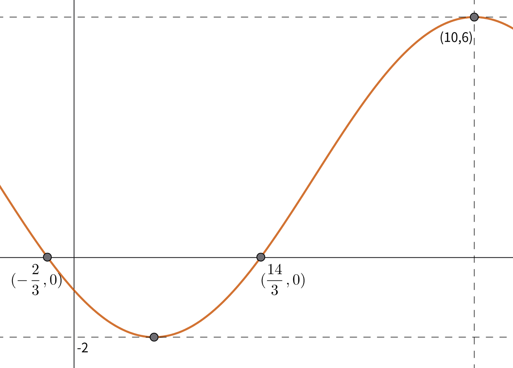

# 三角函数小题

## 例1
已知 $\theta \in (0,\dfrac{\pi}{2})$ 且 $\tan\theta = 2$，求下列各式的值：

| 题号 | 原式 | 题号 | 原式 |
| :---: | :--- | :---: | :--- |
| 1 | $\dfrac{\sin\theta+\cos\theta}{2\sin\theta-\cos\theta}$ | 2 | $\dfrac{\sin 2\theta+\cos 2\theta}{\sin 2\theta-\cos 2\theta}$ |
| 3 | $\sin 2\theta$ | 4 | $\cos 2\theta$ |
| 5 | $\dfrac{\sin^2\theta+1}{\sin\theta\cos\theta}$ | 6 | $\dfrac{\sin 2\theta+1}{\cos 2\theta}$ |
| 7 | $\dfrac{\sin\theta+1}{\cos\theta}$ | 8 | $\dfrac{\sin\theta}{\cos\theta+1}$ |
| 9 | $\dfrac{\sin\theta-1}{\cos\theta+1}$ | 10 | $\dfrac{\sin\theta+1}{\cos\theta+1}$ |
| 11 | $\dfrac{\sin\theta+1}{\cos\theta-1}$ | 12 | $\dfrac{\sin\theta-1}{\cos\theta-1}$ |

---

## 例2
已知 $\alpha,\beta \in (0,\dfrac{\pi}{2})$，根据下列条件，求出 $\alpha+\beta$ 的值：

| 题号 | 条件 |
| :---: | :--- |
| 1 | $\cos(\alpha-\beta)=\dfrac{5}{6}$，$\tan\alpha \cdot \tan\beta=\dfrac{1}{4}$ |
| 2 | $\tan(\pi+\alpha)=\dfrac{1}{2}$，$\tan(\dfrac{\pi}{2}+\beta)=-3$ |
| 3 | $\sin\alpha+\sin\beta=1$，$\cos\alpha-\cos\beta=\sqrt{2}$ |
| 4 | $\sin\alpha-\sin\beta=-\dfrac{1}{2}$，$\cos\alpha-\cos\beta=\dfrac{1}{2}$ |
| 5 | $\sin(\pi-\alpha)=\sqrt{2}\cos(\dfrac{\pi}{2}-\beta)$，$\sqrt{3}\cos(-\alpha)=-\sqrt{2}\cos(\pi+\beta)$ |
| 6 | $\sin\alpha+\cos\beta=1$，$\cos\alpha+\sin\beta=\sqrt{3}$ |

---

## 例3
化简并求值：

| 题号 | 原式 |
| :---: | :--- |
| 1 | $\sqrt{1+\cos 20^\circ}\cdot \left[2\cos 40^\circ+\sin 10^\circ \cdot(1+\sqrt{3}\tan 10^\circ)\right]$ |
| 2 | $\dfrac{\sqrt{3}\tan 12^\circ-3}{\sin 12^\circ\cdot(4\cos^2 12^\circ-2)}$ |
| 3 | $\dfrac{2\cos 10^\circ-\sin 20^\circ}{\cos 20^\circ}$ |
| 4 | $\cos 20^\circ\cdot\cos 40^\circ\cdot\cos 60^\circ\cdot\cos 80^\circ$ |
| 5 | $\sin^2 10^\circ+\cos^2 40^\circ+\sin 10^\circ\cdot\cos 40^\circ$ |

---

## 例4
化简下列式子（$\alpha$ 均有意义）：

| 题号 | 原式 |
| :---: | :--- |
| 1 | $\dfrac{2\cos^4\alpha-2\cos^2\alpha+\frac12}{2\tan(\dfrac{\pi}{4}-\alpha)\cdot\sin^2(\dfrac{\pi}{4}+\alpha)}$ |
| 2 | $\dfrac{(1+\sin\alpha+\cos\alpha)\cdot(\cos\dfrac{\alpha}{2}-\sin\dfrac{\alpha}{2})}{\sqrt{2+2\cos\alpha} }$ |
| 3 | $\sqrt{\dfrac{1+\sin\alpha}{1-\sin\alpha} }-\sqrt{\dfrac{1-\sin\alpha}{1+\sin\alpha} }$ |

---

## 例5

| 题号 | 题目条件与要求 |
| :---: | :--- |
| 1 |求函数 $f(x)=\sin x+\sin 2x$ 在 $x\in(0,3\pi)$ 上的零点个数。|
| 2 |求曲线 $y=\sin x$ 与 $y=2\sin(3x-\dfrac{\pi}{6})$ 在 $x\in[0,2\pi]$ 上的交点个数。|
| 3 |求曲线 $y=\sin(\pi x)$ 与 $y=\dfrac{1}{6}x+\dfrac{1}{3}$ 在 $x\in [0,+\infty ) $ 上的交点个数。|
| 4 |已知 $f(x)=\sin(\omega x-\dfrac{\pi}{6})$（$\omega>0$）在 $x\in[0,\dfrac{\pi}{3}]$ 上的最大值为 $\dfrac{\omega}{5}$，求 $\omega$ 的取值个数。|
| 5 |已知 $f(x)=\sin x$，若 $f(x)<f(x+\dfrac{\pi}{2})$，求 $x$ 的取值范围。|

---

## 例6
根据下列条件，完成问题：

| 题号 | 题目条件与要求 |
| :---: | :--- |
| 1 | 已知 $\cos 2\alpha=4\sin(\alpha+\dfrac{\pi}{4})$，求 $\tan(\alpha+\dfrac{\pi}{3})$ 的值。 |
| 2 | 已知 $\alpha\in(-\dfrac{\pi}{2},\dfrac{\pi}{2})$，且 $\sin\theta+\cos\theta=\dfrac{1}{5}$，求 $\sin\theta-\cos\theta$ 的值。 |
| 3 | 已知 $\alpha\in(-\dfrac{\pi}{3},\dfrac{\pi}{6})$，且 $\cos(\theta+\dfrac{\pi}{3})=\dfrac{4}{5}$，求 $\cos(2\theta-\dfrac{2}{3}\pi)$ 的值。 |
| 4 | 已知 $0<\beta<\alpha<\dfrac{\pi}{2}$，且 $\cos(\alpha-\beta)=\dfrac{4}{5}$，$\cos\alpha\cdot\cos\beta=\dfrac{1}{2}$，求 $\dfrac{1}{\tan\alpha}-\dfrac{1}{\tan\beta}$ 的值。 |
| 5 | 已知 $8\cos^2\alpha-3\sin 2\alpha+1=0$，求 $\tan\alpha$ 的值。 |
| 6 | 已知 $\alpha,\beta\in(0,\dfrac{\pi}{2})$，且 $\tan\alpha=\dfrac{1}{3}$，$\cos\beta=\dfrac{4}{5}$，求 $\cos(\alpha+\beta)$ 的值。 |
| 7 | 已知 $\alpha\in(-\dfrac{\pi}{2},\dfrac{\pi}{2})$，且 $\tan(\alpha+\dfrac{\pi}{3})=\dfrac{\sqrt{3} }{2}$，求 $\sin\alpha$ 的值。 |

---

## 例7
已知函数 $f(x)=\sin(\omega x+\dfrac{\pi}{3})$（$\omega>0$），根据下列条件，求 $\omega$ 的范围：

| 题号 | 条件 |
| :---: | :--- |
| 1 | 若 $f(x)\le f(\dfrac{\pi}{6})$ 在 $x\in R$ 上恒成立。 |
| 2 | 若 $f(x)$ 在 $(0,\pi)$ 上有且仅有两个零点。 |
| 3 | 若 $f(x)$ 在 $[0,\pi]$ 上单调递增。 |
| 4 | 若 $f(x)$ 在 $(0,\pi)$ 上无零点。 |
| 5 | 若 $f(x)$ 在 $(\dfrac{\pi}{6},\dfrac{\pi}{2})$ 上有且仅有两个零点。 |
| 6 | 若 $f(x)$ 在 $(\dfrac{\pi}{6},\dfrac{\pi}{2})$ 上无零点。 |
| 7 | 若 $f(x)$ 在 $[\dfrac{\pi}{6},\dfrac{\pi}{2}]$ 上单调。 |
| 8 | 若 $f(x)$ 在 $[\dfrac{\pi}{6},\dfrac{\pi}{2}]$ 上的值域为 $[-1,\dfrac{\sqrt{3}}{2}]$。 |
| 9 | 若 $f(x)$ 在 $(0,\dfrac{\pi}{3})$ 上有且仅有两个零点和三条对称轴。 |
| 10 | 若 $f(x)$ 分别向左、向右平移 $\dfrac{\pi}{4}$ 个单位长度后，两图象的对称轴重合。 |

---

## 例8

| 题号 | 题目条件与要求 |
| :---: | :--- |
| 1 |已知函数 $f(x)=\sin(\omega x+\varphi)$($\omega>0$，$\lvert\varphi\rvert<\dfrac{\pi}{2}$)的图象关于 $x=-\dfrac{\pi}{3}$ 对称，且 $f(\dfrac{\pi}{6})=0$，$f(x)$ 在 $(\dfrac{\pi}{3},\dfrac{11\pi}{24})$ 上单调递增，求 $\omega$ 的值|
| 2 |已知函数 $f(x)=\sin(\omega x+\varphi)$($\omega>0$，$\varphi\in R$)在 $(\dfrac{7\pi}{12},\dfrac{51\pi}{60})$ 上单调，且 $f(\dfrac{7\pi}{12})=-f(\dfrac{3\pi}{4})$，若 $f(x)$ 在 $[\dfrac{2\pi}{3},\dfrac{13\pi}{6})$ 上恰有五个零点，求 $\omega$ 的范围。|
| 3 |已知函数 $f(x)=\cos(\omega x+\varphi)$（$\omega>0$，$-\dfrac{\pi}{2}<\varphi<0$），$\lvert f(-\dfrac{\pi}{6})\rvert=1$，$f(\dfrac{\pi}{6})=0$，且 $f(x)$ 在 $(\dfrac{\pi}{6},\dfrac{5\pi}{24})$ 上单调，求 $\omega$ 的最大值。|

---

## 例9
根据图像求 $f(x)$ 的解析式：

| 题号 | 参数限制 |
| :---: | :--- |
|1| $f(x)=A\sin(\omega x+\varphi)$ ($A>0$，$\omega>0$，$\lvert\varphi\rvert<\pi$)|  
|2| $f(x)=A\sin(\omega x+\varphi)$ ($A>0$，$\omega>0$，$\lvert\varphi\rvert<\dfrac{\pi}{2}$)|
|3| $f(x)=A\sin(\omega x+\varphi)$ ($A>0$，$\omega>0$，$0 <\varphi <\pi$)|
|4| $f(x)=A\sin(\omega x+\varphi)$ ($A\neq0$，$\omega>0$，$\lvert\varphi\rvert<\dfrac{\pi}{2}$)|
|5| $f(x)=A\sin(\omega x+\varphi)+B$ ($A\neq0$，$\omega>0$，$\lvert\varphi\rvert<\dfrac{\pi}{2}$)|

---

| 题号 | 图 |
|:---:|:---:|
| 图1 |  |
| 图2 |  |
| 图3 |  |
| 图4 |  |
| 图5 |  |

---

## 例10
根据题意求 $f(x)$ 的解析式：

| 题号 | 题目条件与要求 |
| :---: | :--- |
|1|已知 $f(x)=\sin(\omega x+\varphi)$（$\omega>0$，$\lvert\varphi\rvert<\dfrac{\pi}{2}$），$f(0)=\dfrac{1}{2}$，$f(\dfrac{\pi}{6})+f(\dfrac{\pi}{3})=0$，$f(x)$ 在 $(\dfrac{\pi}{6},\dfrac{\pi}{3})$ 上单调。|
|2|已知 $f(x)=\cos(\omega x+\varphi)$（$\omega>0$，$-\pi<\varphi<0$），$f(\dfrac{\pi}{24})=0$，$f(x)\le f(\dfrac{\pi}{6})$ 恒成立，$f(x)$ 在 $(\dfrac{\pi}{6},\dfrac{\pi}{3})$ 上单调。|
|3| 已知 $f(x)=\cos(\omega x+\varphi)$（$\omega\in N^*$ 且 $\omega>1$，$\lvert\varphi\rvert\le\dfrac{\pi}{2}$），$f(\dfrac{7\pi}{12})=0$，$f(\dfrac{\pi}{6})=-\dfrac{1}{2}$，$f(x)$ 在 $(-\dfrac{\pi}{6},\dfrac{\pi}{6})$ 上单调。|

---

## 例11（多选）

1. 已知 $f(x)=\cos x \cdot|\sin x|$，下列正确的是（ ）  
A. $f(x)$ 的最小正周期为 $\pi$  
B. $f(x)$ 的值域为 $[-\dfrac{1}{2},\dfrac{1}{2}]$  
C. $f(x)$ 在 $(\dfrac{\pi}{4},\dfrac{3\pi}{4})$ 上单调递减  
D. $f(x)$ 关于点 $(\dfrac{\pi}{2},0)$ 对称

2. 已知 $f(x)=\tan(|x|+\dfrac{\pi}{4})$，下列正确的是（ ）  
A. $f(x)$ 为偶函数  
B. $f(x)$ 的最小正周期为 $\pi$  
C. $f(x)$ 在 $(0,\dfrac{\pi}{4})$ 上单调递增  
D. $f(x)$ 关于点 $(\dfrac{3\pi}{4},0)$ 对称

3. 已知 $f(x)=|\sin(\omega x)|+\cos(\omega x)$（$\omega>0$）的最小正周期为 $\pi$，下列正确的是（ ）  
A. $f(x)$ 关于直线 $x=\dfrac{\pi}{2}$ 对称  
B. $f(x)$ 关于点 $(\dfrac{3\pi}{8},0)$ 对称  
C. $f(x)$ 在 $[-\dfrac{\pi}{8},\dfrac{\pi}{8}]$ 上单调递增  
D. $f(x)$ 在 $[-\dfrac{\pi}{6},\dfrac{\pi}{6}]$ 上的值域为 $[1,\sqrt{2}]$

4. 已知 $f(x)=\cos x+|\sin\dfrac{x}{2}|$，下列正确的是（ ）  
A. $f(x)$ 关于直线 $x=\pi$ 对称  
B. $f(x)$ 的最小正周期为 $\pi$  
C. $f(x)$ 的值域为 $[0,\dfrac{9}{8}]$  
D. $f(x)$ 在 $(0,\dfrac{\pi}{6})$ 上单调递增

5. 已知 $f(x)=\sin(\cos x)+\cos x$，下列正确的是（ ）  
A. $f(x)$ 关于直线 $x=\pi$ 对称  
B. $f(x)$ 在 $[\pi,2\pi]$ 上单调递增  
C. $f(x)$ 的最小值为 $-1-\sin 1$  
D. $f(x)$ 关于原点对称

6. 已知 $f(x)=\sin(\cos x)+\cos(\cos x)$，下列正确的是（ ）  
A. $f(x)$ 是偶函数  
B. $f(x)$ 的最大值为 $\sqrt{2}$  
C. $f(x)$ 的最小正周期为 $\pi$  
D. $f(x)$ 关于直线 $x=\dfrac{\pi}{2}$ 对称