# 立体几何题目汇总

**例1**：三棱柱 $ABC-A_1B_1C_1$ 中，侧面 $ABB_1A_1$ 是边长为 $2$ 的菱形，$\angle ABB_1 = 60^\circ$，$AC = 2\sqrt{2}$，$M$ 是线段 $A_1B_1$ 中点，$CM = \sqrt{11}$。
求证：平面 $ABC$ $\perp$ 平面 $ABB_1A_1$

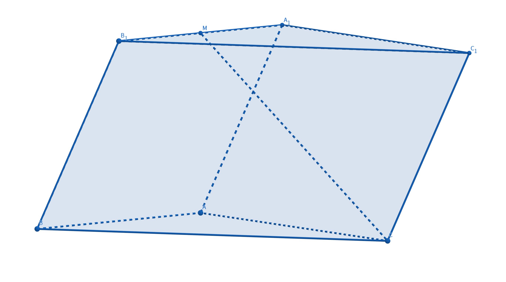

**例2**：四棱锥 $P-ABCD$中，底面$ABCD$为矩形，$AB=2$，$BC=2\sqrt{2}$，$\triangle PBC$ 是正三角形，平面 $PBC$ $\perp$ 平面 $ABCD$，$E$ 是 $BC$ 中点。
求证：平面 $PBD$ $\perp$ 平面 $PAE$

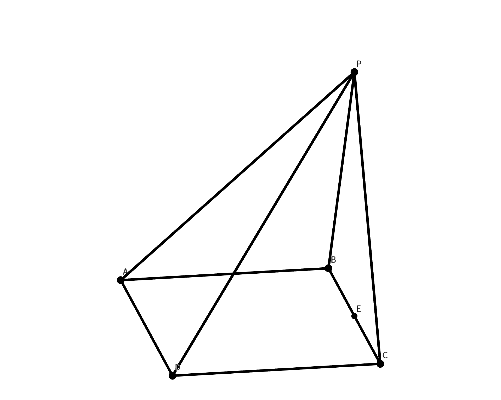

**例3**：三棱柱 $ABC-A_1B_1C_1$ 中，侧面 $BB_1C_1C$ $\perp$ 面 $ABC$，且 $AB=AC$，$A_1B=A_1C$。  
求证：直线$AA_1$ $\perp$ 平面 $ABC$

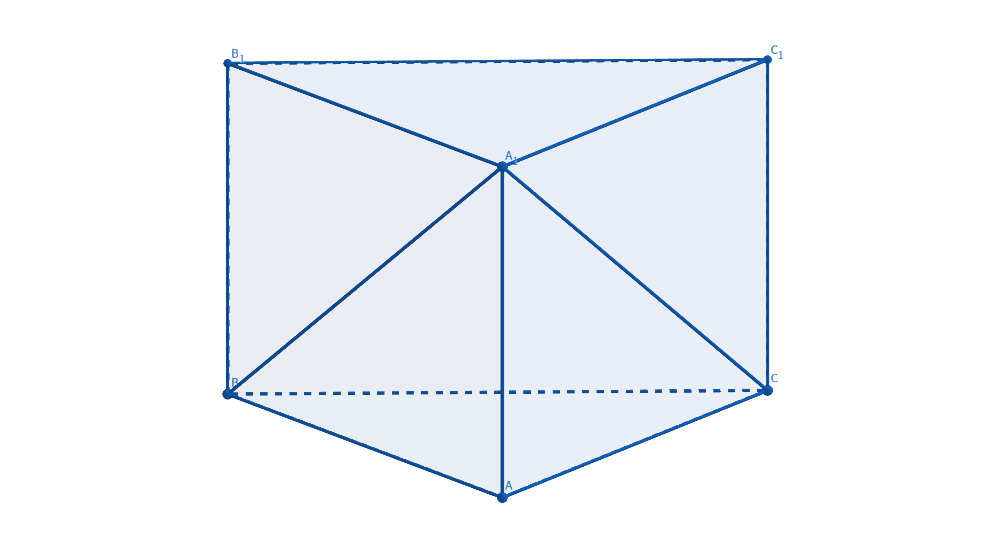

**例4**：三棱柱 $ABC-A_1B_1C_1$ 中，侧面 $BB_1C_1C$ 为矩形，底面 $\triangle ABC$ 为正三角形，$A_1C \perp A_1B$，$AA_1=AB$。
求证：平面 $A_1BC$ $\perp$ 平面 $ABC$

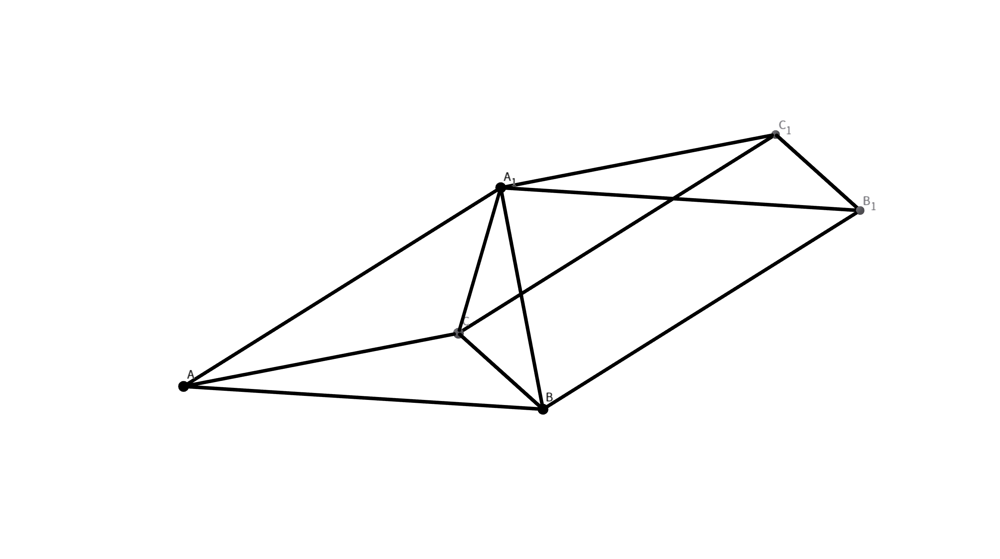

**例5**：半圆柱的轴截面为面 $BCC_1B_1$，线段$BC$ 是半圆柱底面的直径，$O$ 为半圆柱底面圆心，线段$AA_1$ 是半圆柱的一条母线，$E$ 为线段$CC_1$ 的中点，且 $AB=AC=AA_1$。
求证：$OE \perp AB_1$

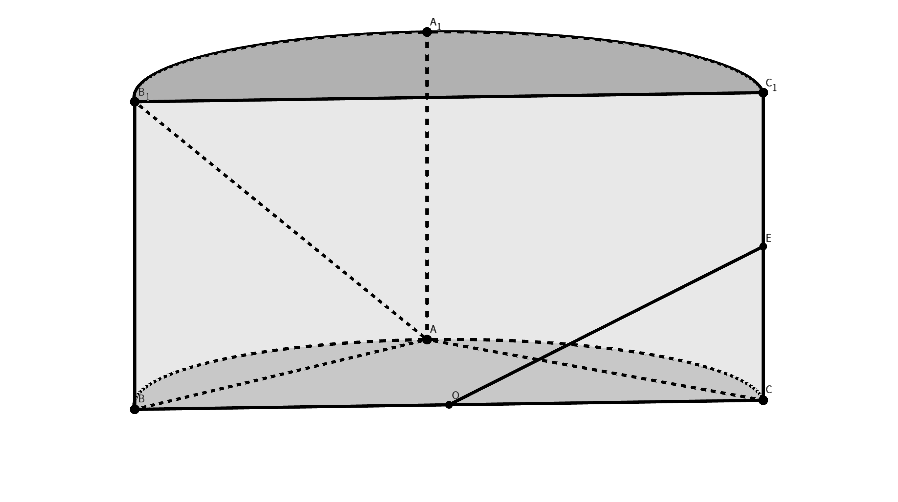

---

**例6**：四棱台 $ABCD-A_1B_1C_1D_1$ 中，$AB // CD$，$DD_1 \perp$ 面 $ABCD$，$BC=CD=\frac{1}{2}AB$。 
求证：$AD \perp BB_1$

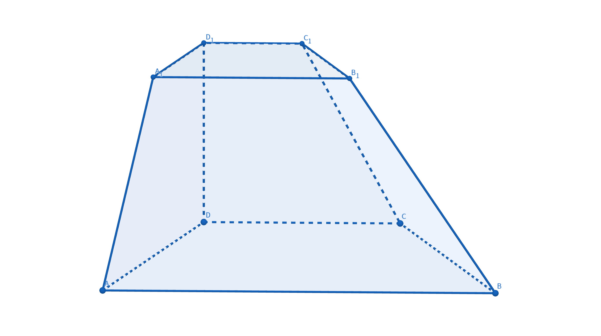

**例7**：三棱柱 $ABC-A_1B_1C_1$ 中，侧面 $BCC_1B_1$ 是矩形，$AC=AA_1$，$AC_1 \perp A_1B$。  
求证：平面 $ACC_1A_1$ $\perp$ 平面 $ABC$

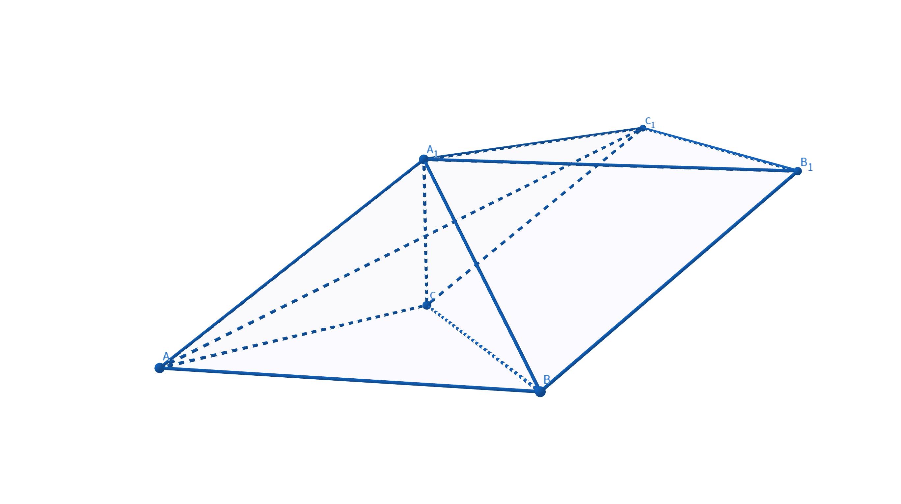

**例8**：四棱锥 $P-ABCD$中，底面 $ABCD$ 是边长为 $4$ 的菱形，$\angle DAB=60^\circ$，$PA=PC$，$PB=PD=2\sqrt{10}$，$M$ 是线段 $PC$ 上的点，且 $\overrightarrow{PC}=4\overrightarrow{MC}$。
求证：平面$PAC$ $\perp$ 平面$BDM$

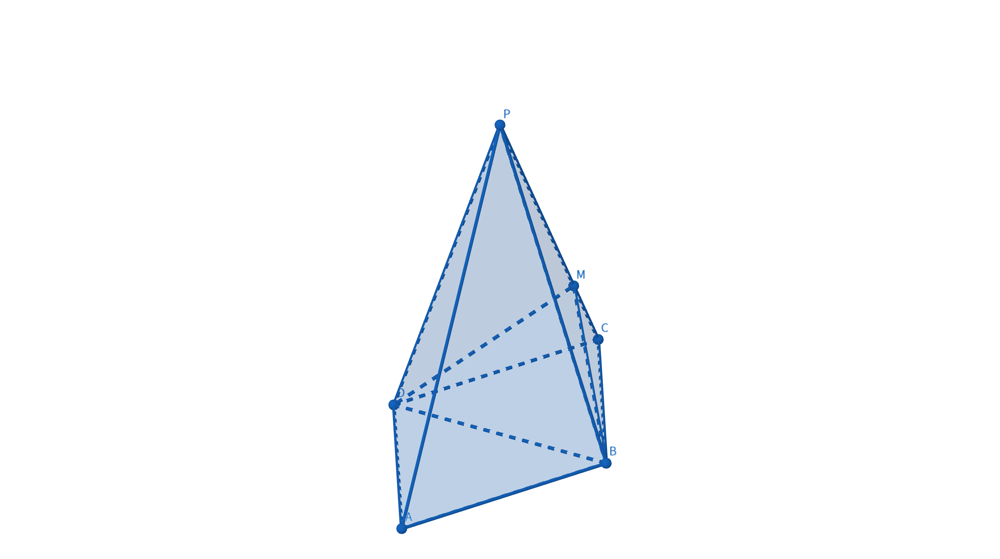

**例9**：三棱台 $ABC-A_1B_1C_1$ 中，$AC \perp AB$，平面 $ABB_1A_1$ $\perp$ 平面$ABC$，$AA_1=A_1B_1=BB_1=\frac{1}{2}AB$。
求证：平面 $ABB_1A_1$ $\perp$ 平面 $ACC_1A_1$

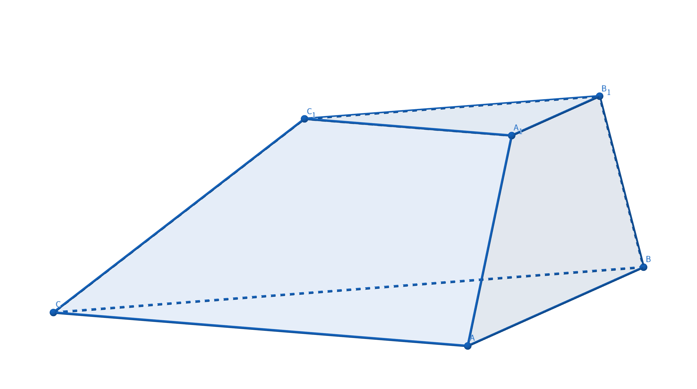

**例10**：直三棱柱 $ABC-A_1B_1C_1$ 中，$AB \perp AC$，$AB=AC=AA_1$，$M$、$N$、$P$ 分别是棱 $A_1C_1$、$BB_1$、$BC$ 中点。 
求证：平面 $APN$ $\perp$ 平面 $A_1MP$

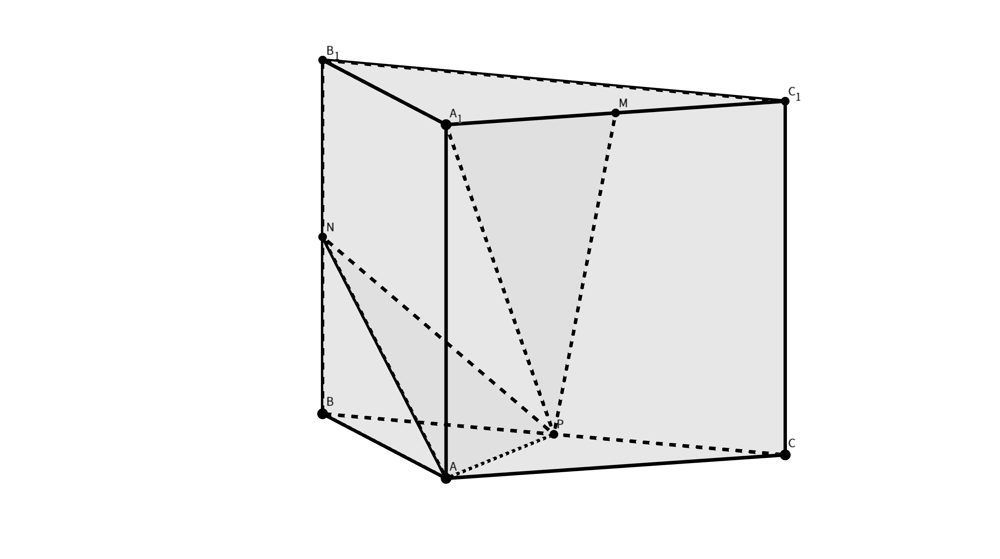

---

**例11**：三棱台 $ABC-A_1B_1C_1$ 中，设面 $AB_1C_1$ $\cap$ 面 $ABC=l$，点 $E$、$F$ 分别在直线 $l$ 和直线 $BB_1$ 上，且 $EF \perp l$，$EF \perp BB_1$（其中 $E$ 不与 $A_1$ 重合，直线$l$和点$E,F$均未在图中画出）
求证：平面 $AEF$ $\perp$ 平面 $BCC_1B_1$

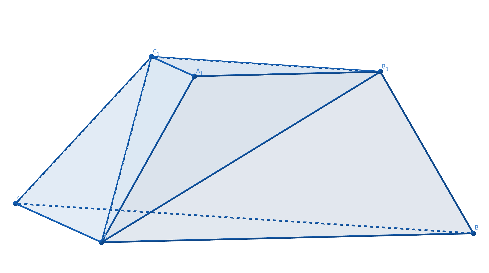

**例12**：四棱台 $ABCD-A_1B_1C_1D_1$的上、下底面分别是边长为 $2$ 和 $4$ 的正方形，平面 $AA_1D_1D$ $\perp$ 平面 $ABCD$，$A_1A = D_1D = \sqrt{17}$，点 $P$ 是棱 $DD_1$ 的中点，点 $Q$ 在棱 $BC$ 上且 $BQ = 3QC$。
求证：直线$PQ //$ 平面 $ABB_1A_1$

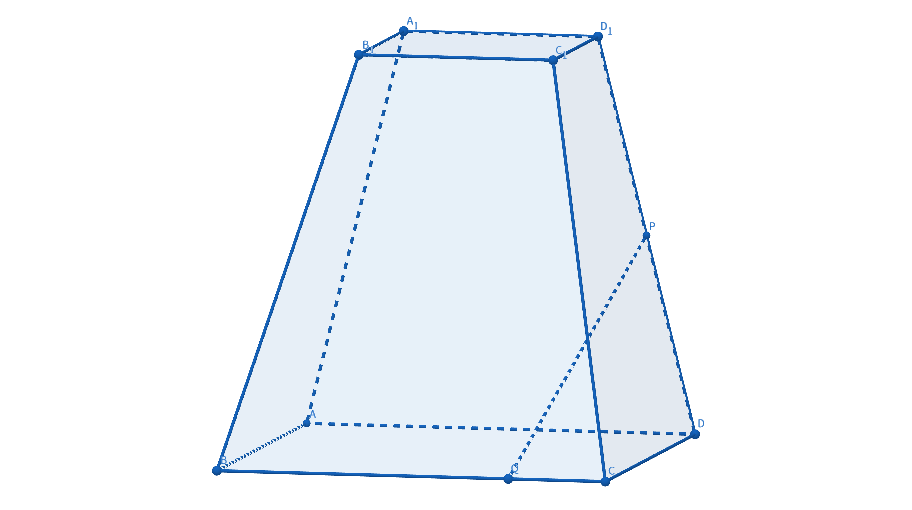

**例13**：三棱柱 $ABC-A_1B_1C_1$ 中，侧面 $BCC_1B_1$ 为正方形，面 $BCC_1B_1$ $\perp$ 面 $ABB_1A_1$，$AB = BC = 2$，$M$、$N$ 分别是 $A_1B_1$、$AC$ 的中点。
求证：$MN //$ 面 $BCC_1B_1$

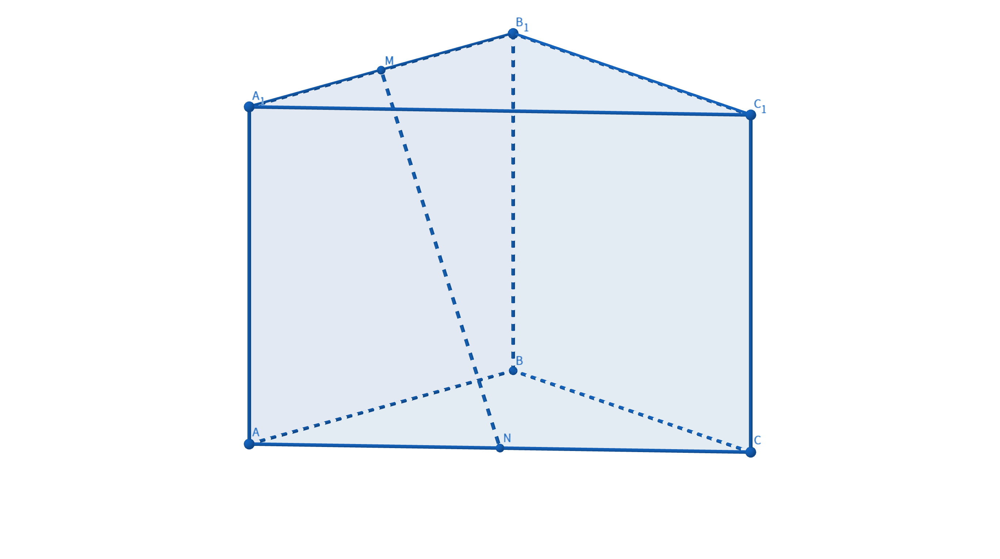

**例14**：菱形 $ABCD$ 中，$\angle BAD = 60^\circ$，以直线 $AB$ 为轴将菱形 $ABCD$ 翻折到菱形 $ABC_1D_1$的位置，使得面 $ABC_1D_1$ $\perp$ 面 $ABCD$，点 $E$ 是 $BC_1$ 中点，连接 $CE$，$DD_1$。
求证：直线$CE //$ 面 $ADD_1$

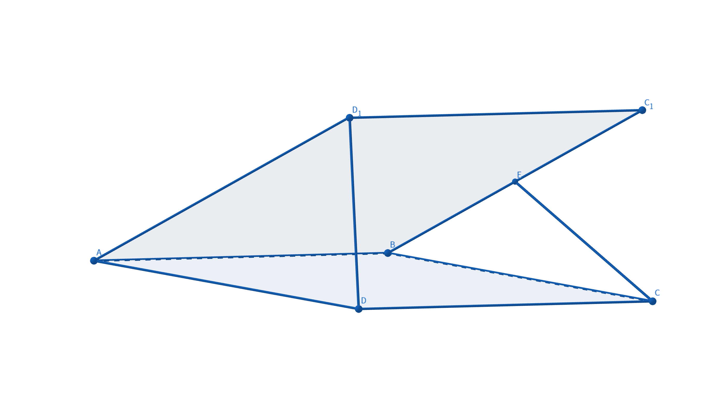

**例15**：五面体 $ABCDEF$ 中，$CD \perp$ 面 $ADE$，$EF \perp$ 面 $ADE$。
求证：$AB // CD$

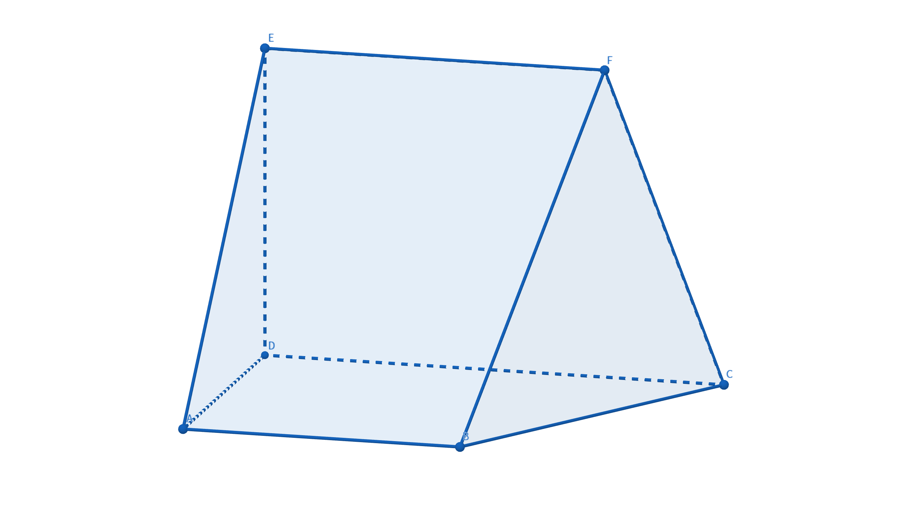

---

**例16**：四棱锥 $P-ABCD$ 中，底面 $ABCD$ 是边长为 $2$ 的正方形，$PA = PB = \sqrt{5}$，点 $N$ 是 $BC$ 中点，点 $M$ 在线段 $PD$ 上，且 $PB //$ 面 $MAC$。
求证：$CM //$ 面 $PAN$

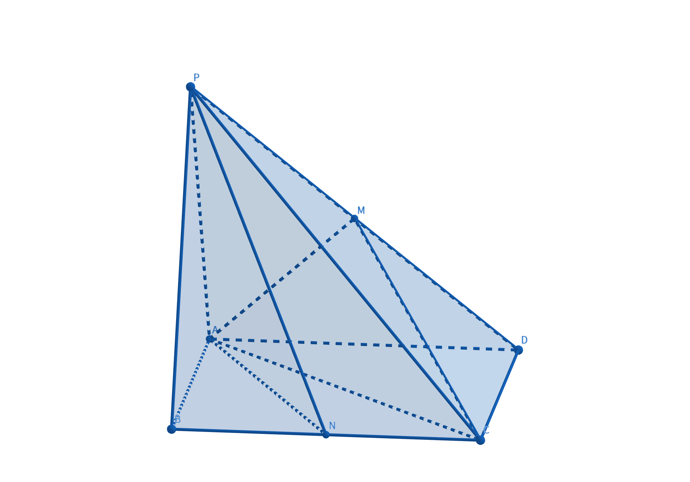

**例17**：正三棱柱 $ABC-A_1B_1C_1$ 中，$AA_1 = AB$，$M$、$N$、$P$ 分别是 $BC$、$AB_1$、$B_1C_1$ 中点。
求证：直线$MN //$ 面 $A_1CP$

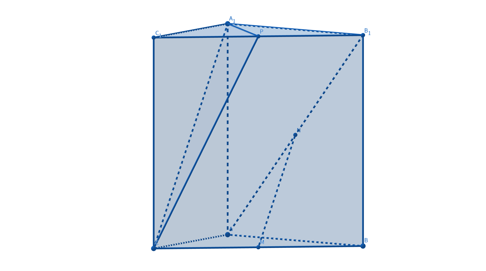

**例18**：矩形 $ABCD$ 是圆柱 $OO'$ 的轴截面，$AB = 4$，$AD = 2\sqrt{2}$，$E$、$F$ 分别是上、下底面圆周上的点，且 $CF // AE$。
求证：$DF // BE$

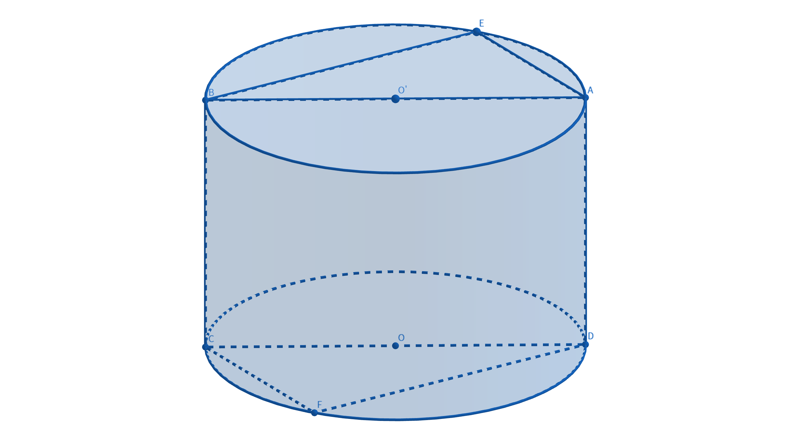

**例19**：在四棱台 $ABCD-A_1B_1C_1D_1$ 中，底面 $ABCD$ 是边长为 $2$ 的正方形，$B_1C_1 = 1$。
求证：直线$AA_1 //$ 面 $BDC_1$

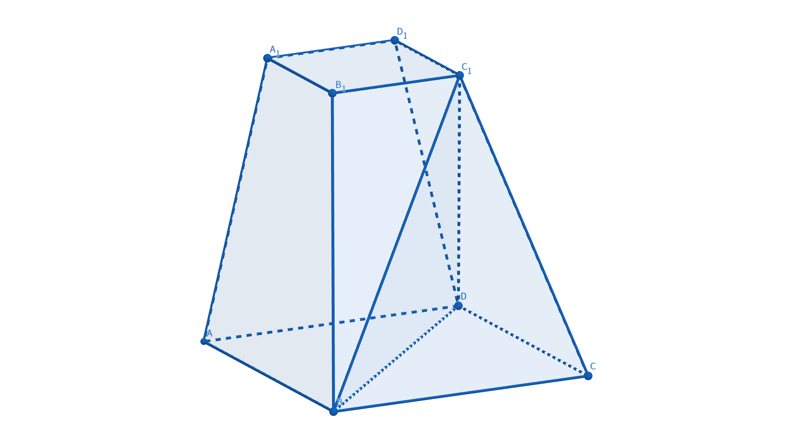

**例20**：由四棱柱 $ABCD-A_1B_1C_1D_1$ 截去三棱锥 $D-A_1DC_1$ 后得到如图几何体，  
四边形 $ABCD$ 是菱形，$AC = 2BD$，$AC \cap BD = O$，$B_1O \perp$ 面 $ABCD$，  
求证：直线$B_1O //$ 面 $A_1DC_1$

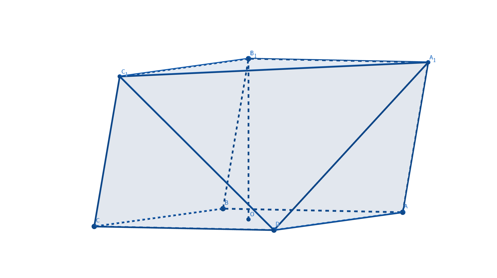

---

**例21**：在四棱锥 $P-ABCD$ 中，底面 $ABCD$ 是平行四边形，$PA=PB$，$DA=DB=\sqrt{2}$，$AB=2PD=2$，点 $E,F$ 分别为 $AB,PB$ 中点。
求证：$PE \perp CF$

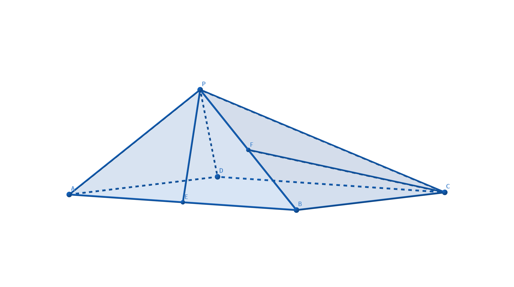

**例22**：在正四棱锥 $P-ABCD$ 中，$PA=AB$，$E$ 是 $PB$ 中点，$F,G$ 分别是 $PA,PC$ 上一点，面 $EFG$ 与面 $ABCD$ 的交线为 $l$（$l$ 未在图中画出），若面 $EFG \perp$ 面 $PBD$。
求证：直线$l \perp$ 面 $PBD$

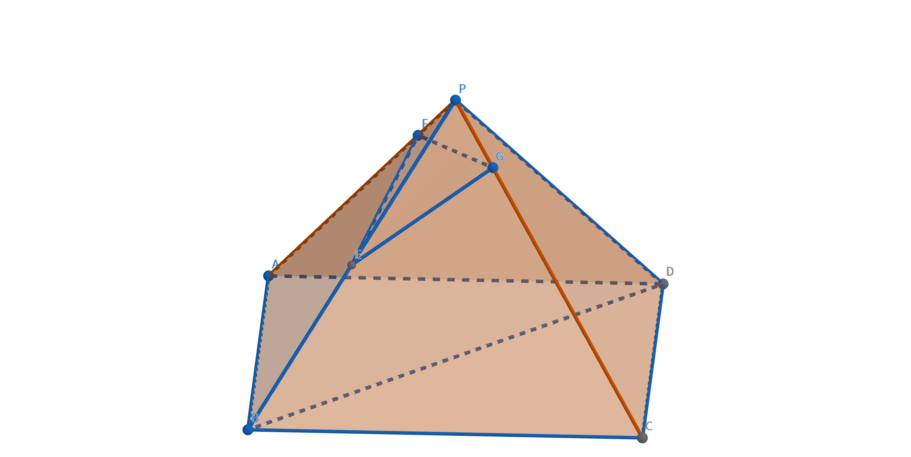

**例23**：在三棱锥 $P-ABC$ 中，$AB \perp BC$，$PB=PC$，$N$ 是 $PC$ 中点，$M$ 是面 $ABC$ 内一点，且 $PM \perp$ 面 $ABC$。
求证：直线$MN //$ 面 $PAB$

**例24**：在直三棱柱 $ABC-A_1B_1C_1$ 中，$\overrightarrow{A_1D}=2\overrightarrow{DB}$，$E,F$ 分别是棱 $BC,B_1C_1$ 上一点（异于端点），若面 $ADE //$ 面 $A_1CF$。
求证：直线$EF //$ 面 $ACC_1A_1$

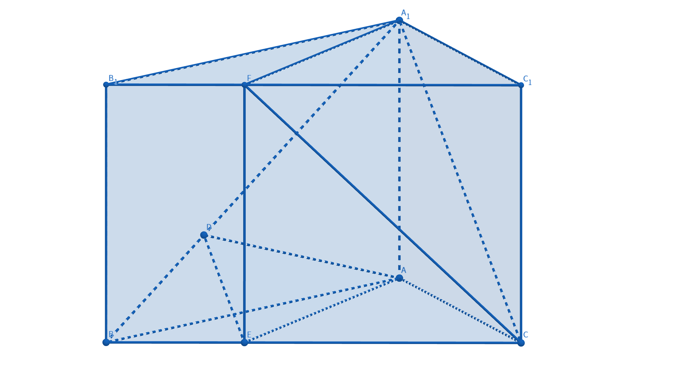

**例25**：在直三棱柱 $ABC-A_1B_1C_1$ 中，侧面 $ABB_1A_1$ 为正方形，$AB=BC$，$E,F$ 分别是 $AC,CC_1$ 中点，$BF \perp A_1B_1$，$D$ 是棱 $A_1B_1$ 上一点。
求证：$BF \perp DE$

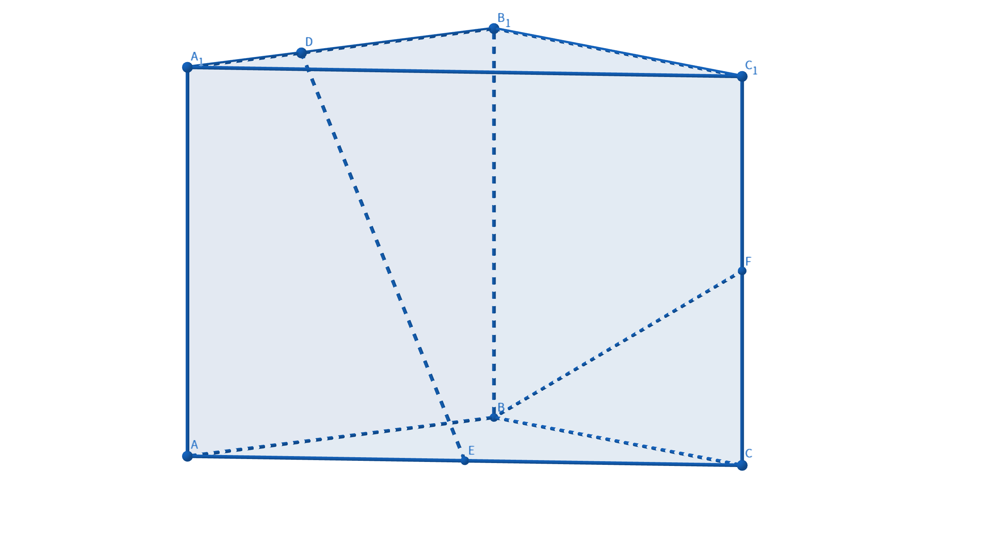

---

**例26**：已知线段 $AB$ 是圆 $O$ 直径，点 $C$ 是圆 $O$ 上一点（异于 $A,B$两点），直线$PA \perp$ 面 $ABC$，过 $A$ 点作 $AE \perp PC$，垂足为 $E$，过 $E$ 点作 $EF \perp PB$，垂足为 $F$。
求证：面 $AEF \perp$ 面 $PAB$

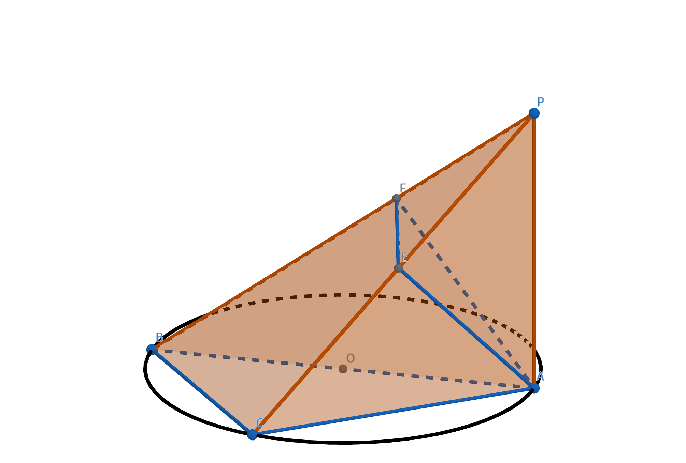

**例27**：在四面体 $AB-CD$ 中，$AD \perp CD$，$AD = CD$，$\angle ADB=\angle BDC$，$E$ 为 $AC$ 中点。
求证：面 $BED \perp$ 面 $ACD$

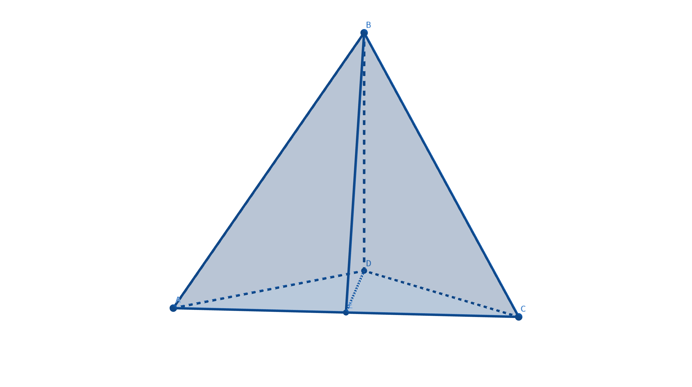

**例28**：在圆锥 $DO$ 中，$AE$ 是底面圆 $O$ 直径，$AE=AD$，$\triangle ABC$ 是圆 $O$ 的内接正三角形，$P$ 是 $DO$ 上一点，且 $PO=\frac{\sqrt{6}}{6}OD$。
求证：直线$PA \perp$ 面 $PBC$

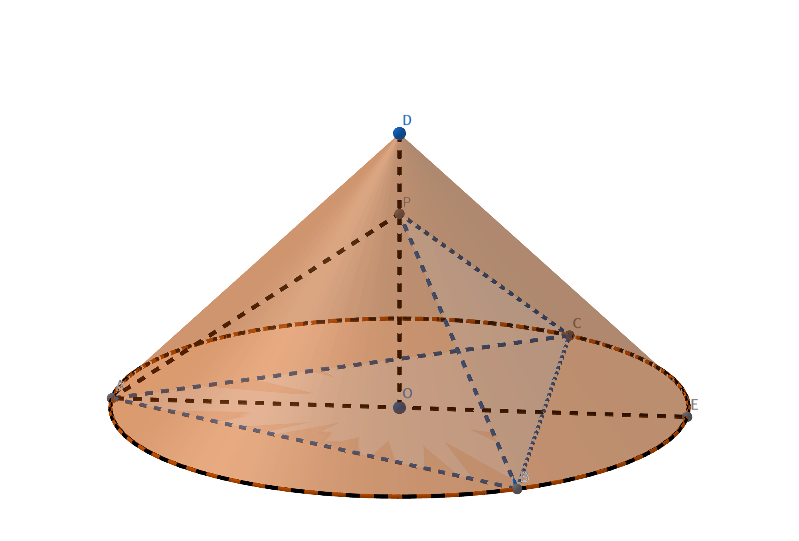

**例29**：在直三棱柱 $ABC-A_1B_1C_1$ 中，$D$ 是 $A_1C$ 中点，$AA_1=AB$，面 $A_1BC \perp$ 面 $ABB_1A_1$。
求证：$AB \perp B_1C$

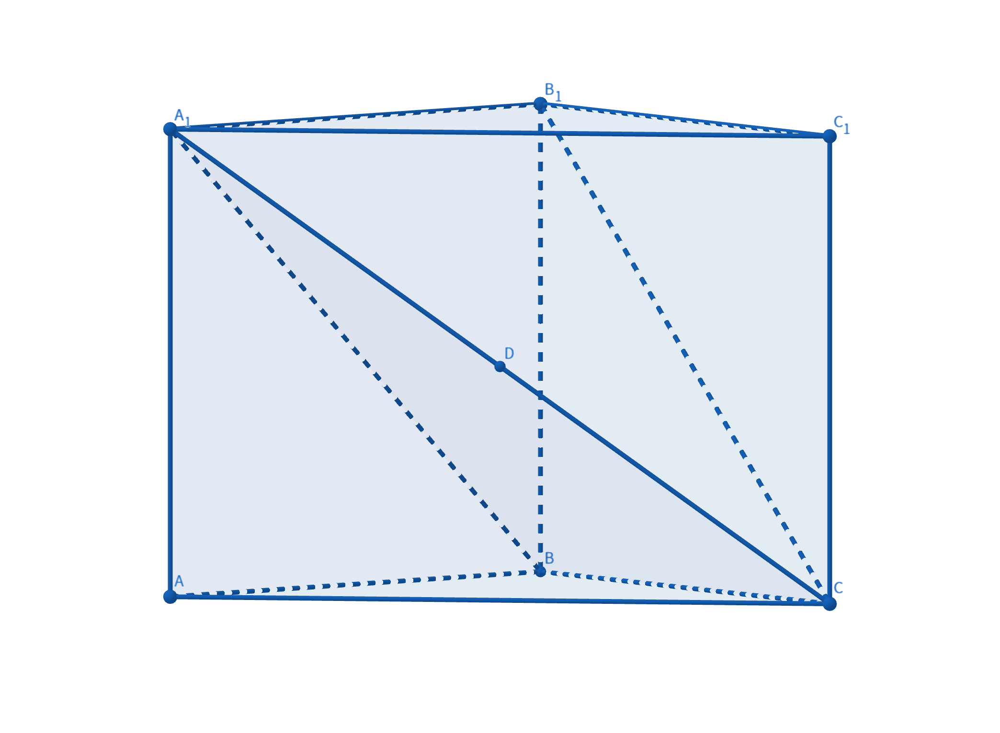

**例30**：在四棱锥 $P-ABCD$ 中，直线$PD \perp$ 面 $ABCD$，$AB // CD$，$AB=2BC=2CD=2AD$，$PD=\sqrt{3}BC$。
求证：$BD \perp PA$

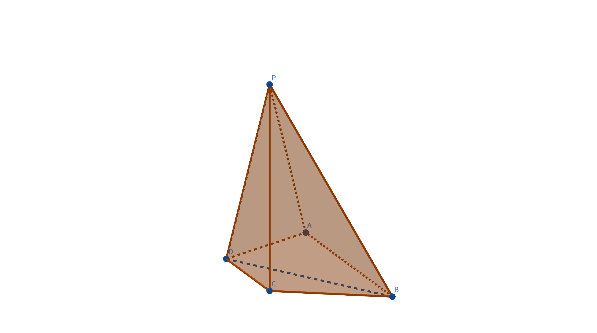

---

**例31**：在三棱柱 $ABC-A_1B_1C_1$ 中，直线$A_1C \perp$ 面 $ABC$，$BC \perp AC$，$AA_1=2$，点 $A_1$ 到面 $BCC_1B_1$ 的距离为 $1$，直线 $AA_1$ 与直线 $BB_1$ 间距离为 $2$。  
(1) 求证：面 $ACC_1A_1 \perp$ 面 $BB_1C_1C$。  
(2) 求直线 $AB_1$ 与面 $BCC_1B_1$ 所成角的正弦值。

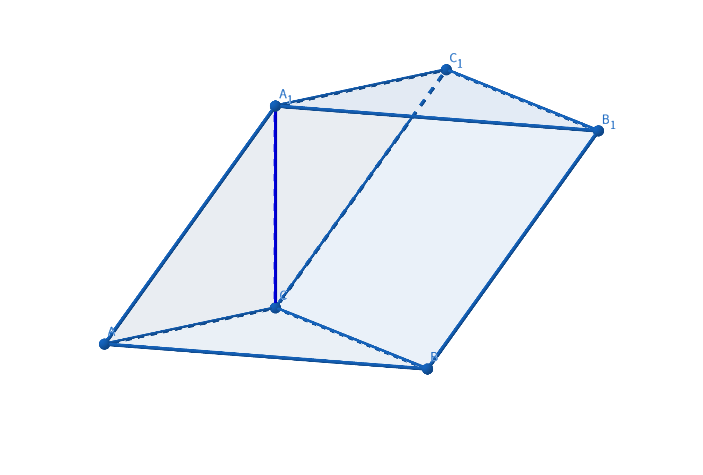

**例32**：在四棱锥 $P-ABCD$ 中，直线$PA \perp$ 面 $ABCD$，$PA=AC=2$，$BC=1$，$AB=\sqrt{3}$。  
(1) 若 $AD \perp PB$，求证：直线$AD \perp$ 面 $PBC$。  
(2) 若 $AD \perp CD$，且二面角 $A-CP-D$ 正弦值为 $\frac{\sqrt{42}}{7}$，求 $AD$ 长。

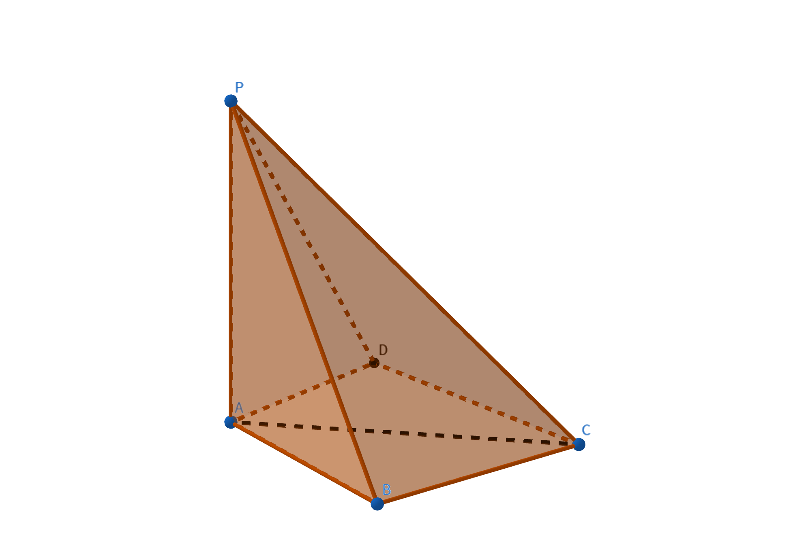

**例33**：在圆柱中，线段$AB, DC, EN$ 均为圆柱的母线，$\triangle ADE$ 是圆柱底面内接正三角形，$AD=AB=8$，点 $F, G, H$ 分别是线段 $EN, BC, BF$ 的中点，直线 $AE$ 与面 $DGH$ 交于点 $M$，面 $DEF$ 与面 $DGH$ 交于直线$l$。（点$M$与直线$l$ 均未在图中画出）
(1) 求 $\frac{AM}{ME}$ 的值。  
(2) 求直线 $l$ 与直线 $DM$ 所成夹角的余弦值。

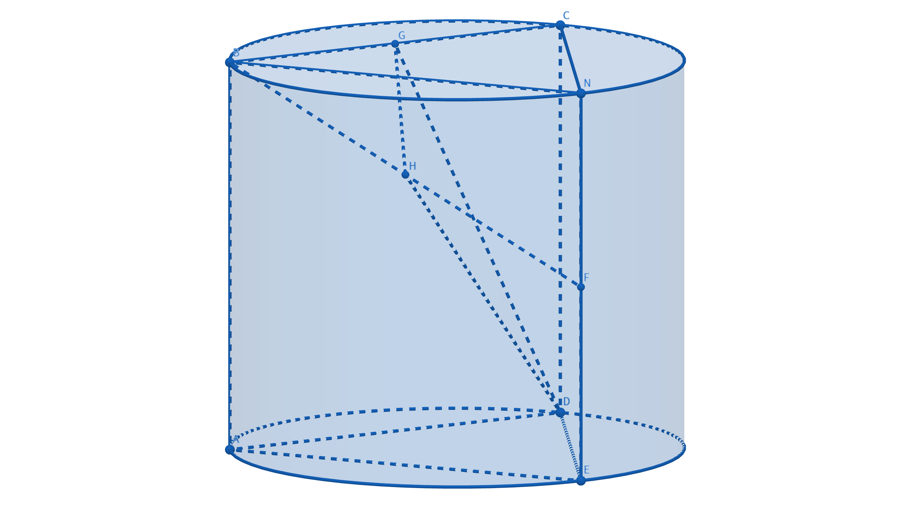

**例34**：在平面四边形 $ABCD$ 中，$AB=AC=CD=1$，$\angle ADC=30^\circ$，$\angle DAB=120^\circ$，将 $\triangle ACD$ 沿线段 $AC$ 翻折到 $\triangle ACP$ 的位置，其中 $P$ 为动点。  
(1) 若 $BP=2AB$，求证：$AB \perp$  $PC$。  
(2) 求二面角 $A-CP-B$ 余弦值的最小值。

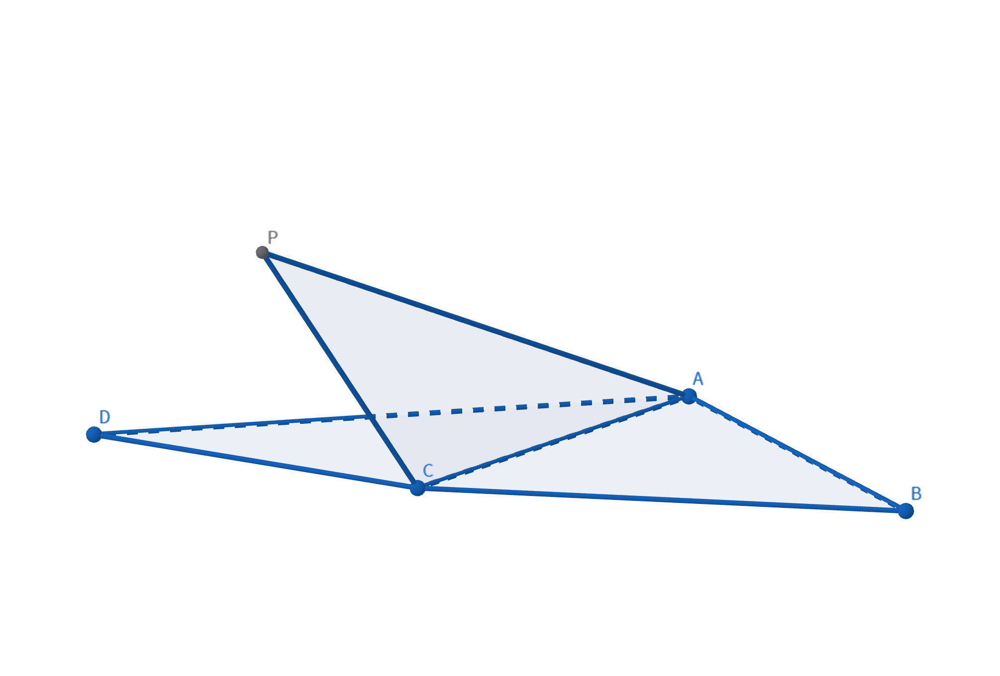

**例35**：在正四棱台 $ABCD-A_1B_1C_1D_1$ 中，$AB=4A_1B_1=4$，$BB_1=3$，$\overrightarrow{DB}=4\overrightarrow{DF}$，棱 $BB_1$ 上的点 $E$ 满足 $AE+EC$ 取得最小值。  
(1) 求证：直线$B_1F \perp$ 面 $AEC$。
(2) 在空间中分别取点 $I,G$，分别使得直线 $DI \perp$ 面$ACD_1$，$AG // CC_1$，设直线 $DI$ 与面 $AEG$ 所成夹角为 $\theta$，求 $\sin\theta$ 值。

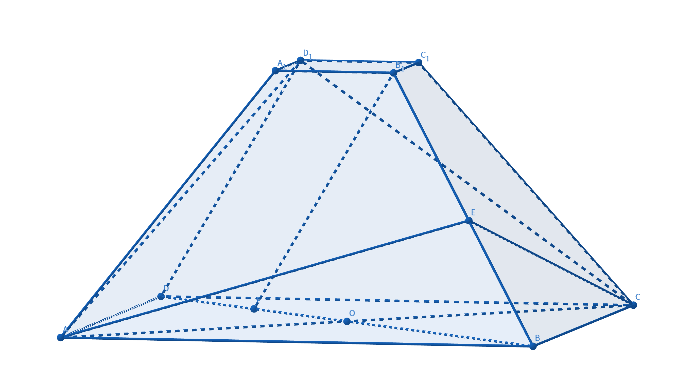

---

**例36**：在平面四边形 $ABCD$ 中，$AB // CD$，$AB=2AD=2CD=2BC=2$，将四边形 $ABCD$ 以直线 $AD$ 为轴翻折到四边形 $AEFD$ 的位置，形成三棱台 $ABE-DCF$。  
(1) 求证：$AD \perp BE$。  
(2) 若 $\cos \angle EAB=\frac{5}{8}$，求直线 $AD$ 与面 $CDF$ 所成夹角的正弦值。  
(3) 若直线 $DE$ 与面 $ABE$ 所成夹角的正弦值为 $\frac{\sqrt{5}}{5}$，求 $BE$ 长。

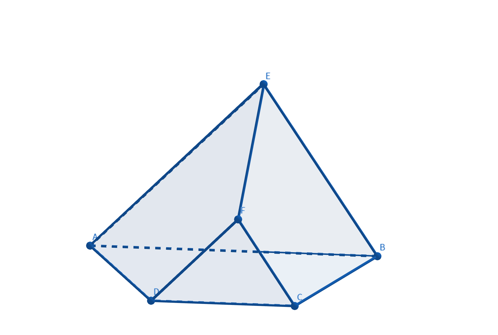

**例37**：在四棱锥 $D-ABPC$ 中，直线$DA \perp$ 面 $ABPC$，$DA=1$，底面四边形 $ABPC$ 内接于 $\odot O$，$AB=AC$，$\overrightarrow{AB} \cdot \overrightarrow{AC} = \overrightarrow{BP} \cdot \overrightarrow{CP}$，四棱锥 $D-ABPC$ 的体积为 $\frac{1}{3}$。  
(1) 求证：$AB \perp CD$。  
(2) 求 $AP$ 长。  
(3) 线段 $DP$ 交以 $O$ 为球心、$OB$ 为半径的球表面于点 $Q$，过点 $A,Q$ 两点的面 $\alpha$ (面 $\alpha$未在图中画出) 分别交线段 $BD,CD$ 于 $S,T$两点，其中直线 $BC //$ 面 $\alpha$，若点 $D$ 到面 $\alpha$ 的距离为 $\frac{\sqrt{2}}{3}$，求直线 $OQ$ 与面 $\alpha$ 所成夹角的正弦值。

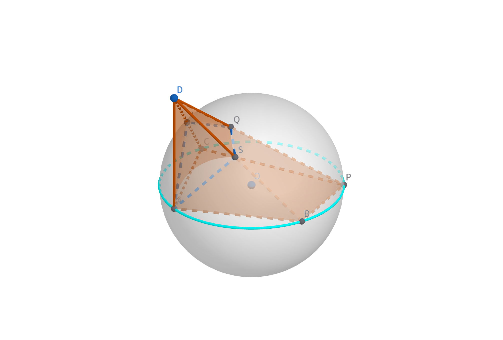

**例38**：在四棱锥 $P-ABCD$ 中，$PA \perp AD$，$AB // CD$，$CD \perp AD$，$AD=CD=2AB=2$，点 $E,F$ 分别为 $PC,CD$ 中点，$DE=CE$。  
(1) 求证：面 $ABE \perp$ 面 $BEF$。  
(2) 若面 $BDE$ 与面 $ABCD$ 所成锐二面角 $\theta \in [\frac{\pi}{4}, \frac{\pi}{3}]$，求 $PA$ 长的范围。

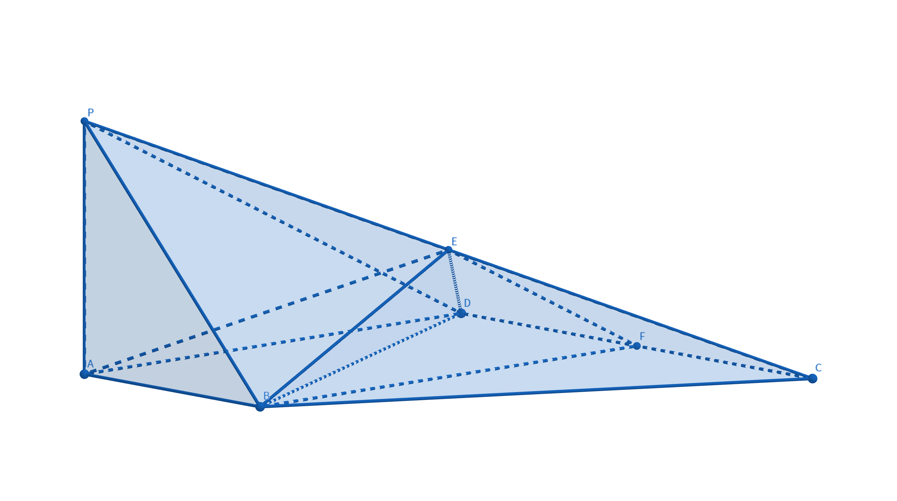

**例39**：在四棱台 $ABCD-A_1B_1C_1D_1$ 中，直线$DD_1 \perp$ 面 $ABCD$，$AB // CD$，$AD=CD=2AB=2C_1D_1=2$，$\angle BAD=60^\circ$。  
(1) 求证：面 $A_1BD \perp CDD_1C_1$。
(2) 若 直线 $CD_1$ 与面 $A_1BD$ 所成夹角的正弦值为 $\frac{3\sqrt{34}}{34}$，且 $DD_1>AB$，求 $DD_1$ 长。  

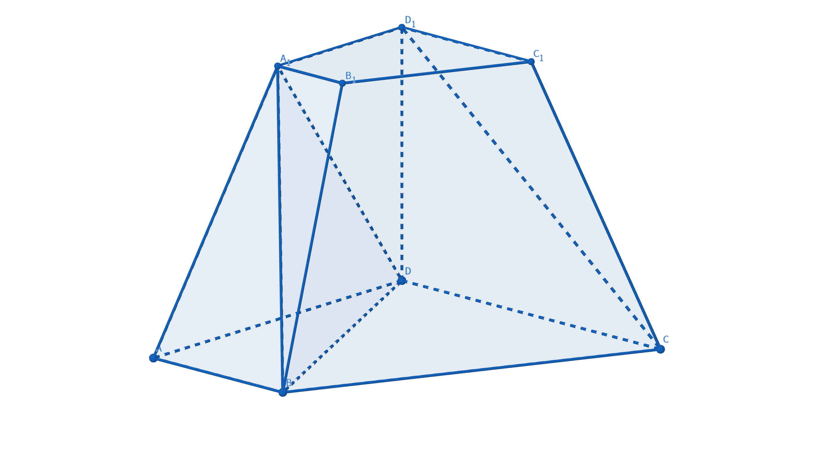

**例40**：在四面体$P-ABC$中，$PB=PC$，$AB \perp BC$，点$M$是点$P$在面$ABC$上的射影，点$D$是线段$PC$中点。
(1)求证：直线$DM \perp$ 面 $PAB$。
(2)若$AC=2AB=4$，$PA=PB$，点P、A、B、C在球心为$O$的球面上。（球$O$未在图中画出）
(i)求证：点$O$在面$PAC$上。
(ii)求直线$AP$与面$PBC$所成夹角的正弦值最大值。

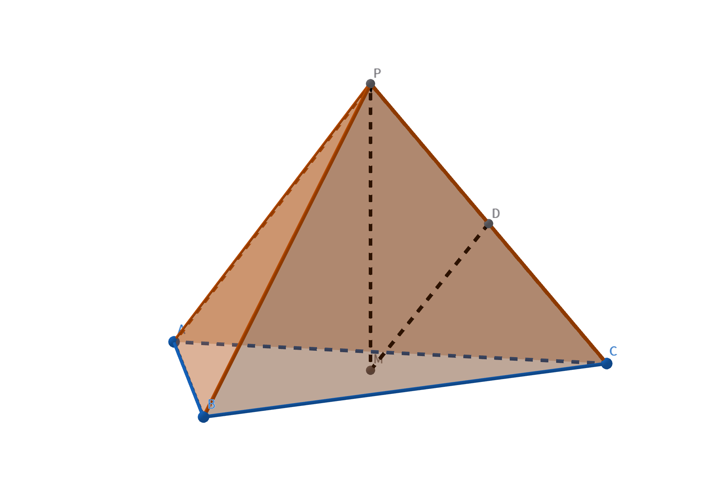

---

**例41**：在三棱柱$ABC-A_1B_1C_1$中，$M,N$分别为棱$AB,BC$上的点，满足：$BM=2AM,BN=CN$，且$\triangle ABC_1$与$\triangle MNC_1$ 面积之比为3。
(1)求证：直线$AC_1$//平面$A_1MN$。
(2)求点$A_1$到平面$ABC_1$与到平面$MNC_1$的距离之比。
(3)若$BC>AB$，直线$AB,BC,A_1B$两两相互垂直，求平面$ABC_1$与平面$MNC_1$所成角余弦值的取值范围

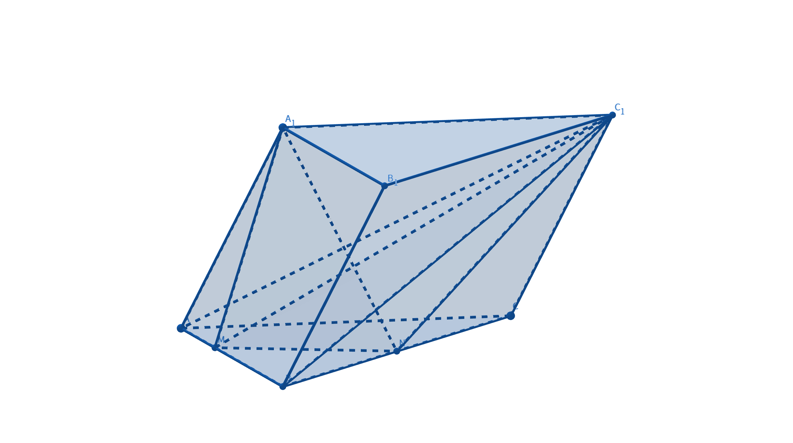

---

